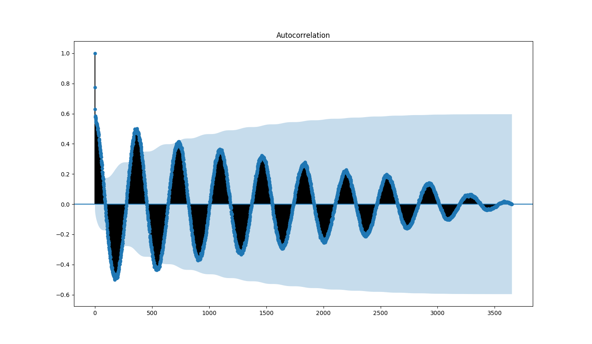
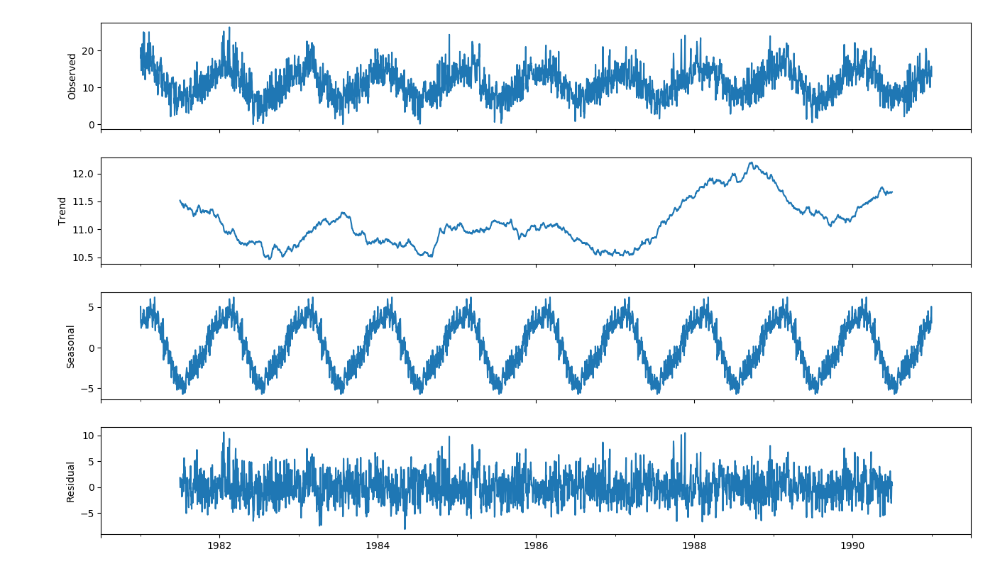
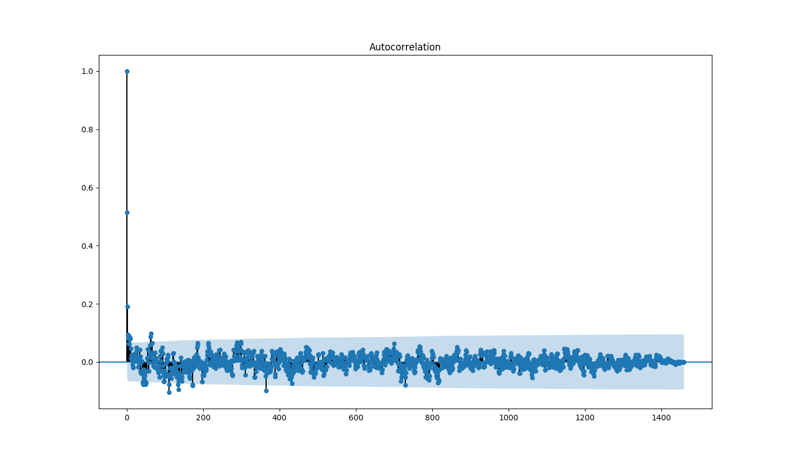
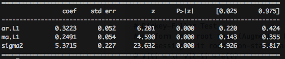

# Stochastic time-series forecast with ARMA or ARIMA
# Overview
The goal is to find the `stationarity` of the target process (i.e., minimum
temperature here) to employ the time-series forecast model AutoRegressive
Integrated Moving Average (ARIMA).

# Theory
Non-stationarity is defined when `[unit
root](https://en.wikipedia.org/wiki/Unit_root)` of the characteristic equation
of the autoregressive model exists, or the less common case when [root is larger
than 1](https://onlinelibrary.wiley.com/doi/epdf/10.1111/j.1468-2354.2010.00625.x).
For now the focused is on unit root test for stationarity. 

# Data 
[Download](https://datamarket.com/data/set/2324/daily-minimum-temperatures-in-melbourne-australia-1981-1990#!ds=2324&display=line)
the minimun daily temperature of Melbourne, Australia from 1981 to 1990. Two
years are missing data on 12/31, and are filled in by linear interpolation.
Three days of data value with question marks are removed.

Read the data, rename the variable, add time index, and cast the data type to numeric:
```python
import pandas as pd
series = pd.read_csv('~/Downloads/daily-minimum-temperatures-in-me.csv', error_bad_lines=False) 
series.rename(columns={'Daily minimum temperatures in Melbourne, Australia, 1981-1990':'mint'},inplace=True) # rename minimum temp to 'mint'
y = pd.to_numeric(series["mint"],downcast='float')
y.index = pd.DatetimeIndex(start='1981-01-01',end='1990-12-31',freq='d')
```

Check out the data lag correlation to determine how much lag is appropriate:
```python 
from statsmodels.graphics.tsaplots import plot_acf
from matplotlib import pyplot
plot_acf(y)
```

Notice there are periodic oscillations due to the seasonal cycle:
<p align="center">
    
</p>

Decompose the data into trend, season, and residual (first guess of stationary process):
```python
from statsmodels.tsa.seasonal import seasonal_decompose  
decomposition = seasonal_decompose(y, model='additive',freq=365) # 365 is the sampling freq (N/T) in a period T=year
decomposition.plot()
```
<p align="center">
    
</p>
Notice the warming trend, seasonal cycle and randomness of day-to-day residuals.

The residual might be the stationary time-series needed, let's look at the autocorrelation:
```python
plot_acf(decomposition.resid[365:365*5])
```
<p align="center">
    
</p>

Use the residual time series and split it into test and validation sets. 
``` python
y = decomposition.resid
y.index = pd.DatetimeIndex(start='1981-01-01',end='1990-12-31',freq='d')
test, valid = y[365:365*4], y[365*4:365*10],
test.index, valid.index = y.index[365:365*4], y.index[365*4:365*10]
```

# Build Model 
Set up the model hyperparameters
  * (p,d,q): order of the AR parameters, differences, and MA parameters.
  * (P,D,Q,s): order of the AR parameters, differences, and MA parameters for seasonal component.
```python
import itertools
p = d = q = range(0, 2)
pdq = list(itertools.product(p, d, q)) # (p,d,q)
#seasonal_pdq = [(x[0], x[1], x[2], 365) for x in pdq] # (P,D,Q,s), sampling freq = 365 
seasonal_pdq = [(0, 0, 0, 0)]
```

[Akaike Information Criterion (AIC)](https://en.wikipedia.org/wiki/Akaike_information_criterion) 
is used to select the best model from grid search: 
```python
import warnings
from statsmodels.tsa.arima_model import ARIMA # ARIMA model
from statsmodels.tsa.stattools import adfuller # augmented Dickey-Fuller test
from statsmodels.tsa.statespace.sarimax import SARIMAX # seasonal ARIMA

warnings.filterwarnings("ignore")
aic_min = float("inf") 
param = (0,0,0,0,0,0) # (p,d,q,P,D,Q,s)
best_model = None # low AIC is better

for x1 in pdq:
    for x2 in seasonal_pdq:
        try:
            mod = SARIMAX(test, order = x1, seasonal_order = x2, enforce_stationarity = False, enforce_invertibility = False)
            results = mod.fit() # this stage is slow 
            print("(p,d,q,P,D,Q,s) = {}: AIC = {}".format(x1 + x2, results.aic))
            if results.aic < aic_min:
                aic_min = results.aic
                param = x1 + x2
                best_model = mod
        except:
            continue
```

Show the best model hyperparameter
```python
print("Best (p,d,q,P,D,Q,s) =", param)
```
> Best (p,d,q,P,D,Q,s) = (1, 0, 1, 0, 0, 0, 0)

Show the statistics of the best model
```python
results = best_model.fit()
print(results.summary().tables[1])
```

<p align="center">
    
</p>

```ptyhon
results.plot_diagnostics(figsize=(16, 12))
```

```python

#series["mint"] = series.mint.to_numeric(downcast='float')
#series["mint"] = pd.to_numeric(series["mint"],errors='coerce',downcast='float')
#series.dropna(inplace=True)
#pyplot.plot(range(0,len(series['mint'])),series['mint'])
#pyplot.ion() # use this to avoid block during show
#pyplot.show()
#series["mint"][0:1000].isnull().values.any()

# plot lag-autocorrelation
#y.index = pd.DatetimeIndex(series['Date'])

# plot seasonality  
#pyplot.rcParams['figure.figsize'] = 11, 9
# The additive model is Y[t] = T[t] + S[t] + e[t]
# The multiplicative model is Y[t] = T[t] * S[t] * e[t]
# The seasonal component is first removed by applying a convolution filter to the data. The average of this smoothed series for each period is the returned seasonal component. 
# pyplot.show()


# Dickey-Fuller Test
# perform unit root test (Augmented Dickey-Fuller test)
# possessing unit root (non-stationarity) is the null hypothesis 
# y[t] = \r y[t-1] + e[t]
# A unit root is present when \r = 1. 
# Therefore D Y[t] = (r - 1) y[t-1] + e[t] = d y[t-1] + e[t], and d = 0 becomes the null hypothesis for Dickey-Fuller test for stationarity test.
#result = adfuller(series['mint'])
#print('ADF Statistic: %f' % result[0])
#print('p-value: %f' % result[1])
#print('Critical Values:')
#for key, value in result[4].items():
#    print('\t%s: %.3f' % (key, value))
# fit model
#model = ARIMA(series["mint"], order=(5,1,0))
#model_fit = model.fit(disp=0)
#print(model_fit.summary())


# parser = lambda x: datetime.strptime(x, '19'+x, '%y %m') 
# series = pd.read_csv('~/Downloads/daily-minimum-temperatures-in-me.csv', error_bad_lines=False, data_parser=parser) 
# data.drop([3650],inplace=True) # remove row 3650
# data = pd.DataFrame.from_csv('~/Downloads/all/application_test.csv')
# print(list(data.columns.values)) # list the column names
# remove rows with at least one nan, can do dropna(axis='columns') to drop the columns with at least one nan, do dropna(inplace=True) for inplace replacement
#data = data.sort_values(by=['AMT_REQ_CREDIT_BUREAU_YEAR','AMT_REQ_CREDIT_BUREAU_QRT','AMT_REQ_CREDIT_BUREAU_MON'], ascending=True)[['AMT_CREDIT','AMT_REQ_CREDIT_BUREAU_MON','AMT_REQ_CREDIT_BUREAU_QRT','AMT_REQ_CREDIT_BUREAU_YEAR']].dropna(axis='rows')
#credit_byyear = data.sort_values(by=['AMT_REQ_CREDIT_BUREAU_YEAR','AMT_REQ_CREDIT_BUREAU_QRT','AMT_REQ_CREDIT_BUREAU_MON'], ascending=True)[['AMT_CREDIT','AMT_REQ_CREDIT_BUREAU_MON','AMT_REQ_CREDIT_BUREAU_QRT','AMT_REQ_CREDIT_BUREAU_YEAR']].dropna(axis='rows')
#credit_byyear['AMT_CREDIT'].plot()
#data["Daily minimum temperatures in Melbourne, Australia, 1981-1990"].plot()
#pyplot.show()
```


# References
* [seasonal ARIMA (SARIMAX)](https://www.statsmodels.org/dev/generated/statsmodels.tsa.statespace.sarimax.SARIMAX.html)
* [SARIMAX.fit() theory](https://www.statsmodels.org/dev/generated/statsmodels.tsa.statespace.sarimax.SARIMAX.fit.html#statsmodels.tsa.statespace.sarimax.SARIMAX.fit)
* [seasonal_decomposition](https://www.statsmodels.org/dev/generated/statsmodels.tsa.seasonal.seasonal_decompose.html)
* [augmented Dickey-Fuller theory](http://support.sas.com/documentation/cdl/en/etsug/63939/HTML/default/viewer.htm#etsug_macros_sect007.htm)
* [minimum temperature data](https://datamarket.com/data/set/2324/daily-minimum-temperatures-in-melbourne-australia-1981-1990#!ds=2324&display=line)
* [reference project (SF crime)](https://github.com/liyenhsu/SF-Crime-Analysis/blob/master/sf_crime_analysis.ipynb?fbclid=IwAR1sqdDd2izosGw6axuYoGei3288ab-lBgvS6LfDyaeJ8IWzFkNmGtm1cZ4)
* [reference project (min T)](https://machinelearningmastery.com/make-sample-forecasts-arima-python/)
* [unit root](https://en.wikipedia.org/wiki/Unit_root)
* [explosive process](https://onlinelibrary.wiley.com/doi/epdf/10.1111/j.1468-2354.2010.00625.x)
* [Akaike information criterion (AIC)](https://en.wikipedia.org/wiki/Akaike_information_criterion)
